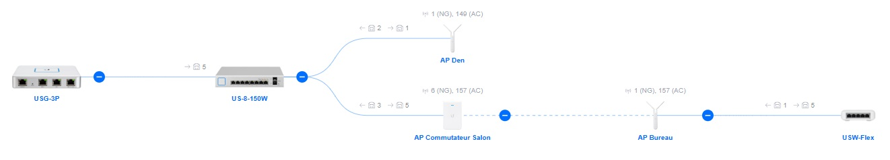

# Ubiquiti Unifi wireless access debugging aids

The Ubiquiti Unifi product line uses a technology nicknamed "Virtual Wire" to mesh their equipment.

Unlike conventional WiFi networks, "Virtual Wire" allows VLAN tagged packets to pass through the link: this is the point of interest.

Any configuration of the Unifi equipment should be done using the Unifi Network Controller. Configuration of the underlying network topology can be challenging since VLAN tagged traffic originating from other connecting devices can flow through the "Virtual Wire". Fortunately, Unifi devices provide the tools to debug problem paths and to take advantage of the "Virtual Wire".

However, the Unifi Network Controller does not provide any debugging aid other than the ability to login into each Unifi device on the networkk.

**Caution: ssh access is required to do this debugging.** Device SSH authentication credentials are found in the Advanced tab of the /manage/default/settings/system configuration page of the Network Controller appliance.

<details>

<summary>Before logging in a Unifi device, read Ubiquiti's disclaimer:</summary>

````

BusyBox v1.25.1 () built-in shell (ash)


  ___ ___      .__________.__
 |   |   |____ |__\_  ____/__|
 |   |   /    \|  ||  __) |  |   (c) 2010-2024
 |   |  |   |  \  ||  \   |  |   Ubiquiti Inc.
 |______|___|  /__||__/   |__|
            |_/                  https://www.ui.com

      Welcome to UniFi USW-Flex!

********************************* NOTICE **********************************
* By logging in to, accessing, or using any Ubiquiti product, you are     *
* signifying that you have read our Terms of Service (ToS) and End User   *
* License Agreement (EULA), understand their terms, and agree to be       *
* fully bound to them. The use of SSH (Secure Shell) can potentially      *
* harm Ubiquiti devices and result in lost access to them and their data. *
* By proceeding, you acknowledge that the use of SSH to modify device(s)  *
* outside of their normal operational scope, or in any manner             *
* inconsistent with the ToS or EULA, will permanently and irrevocably     *
* void any applicable warranty.                                           *
***************************************************************************

````

</details>

The following layout shows a complete Unifi defined network where all devices are reachable over a single "Management VLAN" (defined in the "IP Settings" of each device). The dotted line in the center of the layout represents the "Virtual Wire" while everything else is hardwired.

**

No client access via 802.11-Standards to the Management VLAN is represented here. Best practices suggest that no such access be allowed to strengthen security. This means that the access points at either end of the "Virtual Wire" do not have to belong to any of the WiFi networks defined in the Unifi Network Controller. This avoids generating useless beacons when all that is required is the "Virtual Wire".

Two non-destructive scripts are defined in this project:
- StatusReport.sh displays the state of a device exclusive of client information.
- AddVLAN.sh adds an arbitrary VLAN entry to an existing bridge to allow tracing packet flowing through this device.

These scripts are uploaded to the Unifi device admin's home directory using the SCP utility. The admin's directory is /etc/persistent, which was *persistent* in earlier versions of the Unifi firmware. Nowadays, this storage area is refreshed whenever the device restarts. On a modern Windows system:
````
scp .\StatusReport.sh <UserName>@<deviceIP>:/etc/persistent/StatusReport.sh
scp .\AddVLAN.sh <UserName>@<deviceIP>:/etc/persistent/AddVLAN.sh
````
and you will have to enter the password twice. The login sequence is:
````
ssh -l <UserName> <deviceIP>
chmod +x StatusReport.sh
chmod +x AddVLAN.sh
````

In the layout above, the three switches (US-8-150W, UAP-HD-IW, USW-Flex) connect to non Ubiquiti equipment using a combination of tagged (VLAN) and untagged (Access) connections. This is the case of the USG-3P Unifi router which does not support VLAN tagging.

The three access points (the same UAP-HD-IW and two UAP-AC-Mesh) provide the wireless support for the environment.

Presume some network is accessible on VLAN 123. This test VLAN is declared in the Unifi Network Controller as controlled by a "Third-Party Gateway" with DHCP Guarding. Can we verify that a client on the USW-Flex will have access to this network?

Here are the configuration details of the "Management VLAN" in this example: skip over to the test before looking at these details.

<details>

<summary>USW-Flex-US Status Report:</summary>

````
USW-Flex-US.7.0.44# chmod +x AddVLAN.sh
USW-Flex-US.7.0.44# chmod +x StatusReport.sh
USW-Flex-US.7.0.44# ./StatusReport.sh
-------------------------------------------------------------------------------
Chassis:
  ChassisID:    mac ac:8b:a9:ae:3b:5b
  SysName:      USW-Flex
  SysDescr:     USW-Flex, 7.0.44.15586
  MgmtIP:       192.168.166.245
  MgmtIface:    2
  MgmtIP:       fdfa:fe0:50aa:389d:ae8b:a9ff:feae:3b5b

IPv4 / IPv6:
    inet 192.168.166.245/24 brd 192.168.166.255 scope global eth0
    inet6 fdfa:fe0:50aa:389d:ae8b:a9ff:feae:3b5b/64 scope global dynamic
    inet6 fe80::ae8b:a9ff:feae:3b5b/64 scope link

VLAN to port table (On a USW-Flex, port 6 is the CPU and ports 1 to 5 are numbered 4 down to 0)

    VLAN 1:
        vid: 1
        ports: 0 1 2 3 4 6t
[ ... snip ... ]
    VLAN 123:
        vid: 123
        ports: 0t 1t 2t 3t 4t 6t
    VLAN 166:
        vid: 166
        ports: 0t 1t 2t 3t 4t 6
[ ... snip ... ]


Address Resolution Table
Port    MAC                     Last Seen
0       b8:e9:37:f9:a7:00       60
[ ... snip ... ]
0       f4:92:bf:82:77:15       2

General Temperature (C): N/A

Fan Duty Level: N/A

Power Source:
      Type(bitmask)          Voltage(V)
==========================   ============
                AT,0x2          51.89

Total Power Limit(mW): 20000

Port  OpMode      HpMode    PwrLimit   Class   PoEPwr  PwrGood  Power(W)  Voltage(V)  Current(mA)
                              (mW)
----  ------  ------------  --------  -------  ------  -------  --------  ----------  -----------
   2    Auto        Dot3af     19362  Unknown     Off      Bad      0.00        0.00         0.00
   3    Auto        Dot3af     19473  Unknown     Off      Bad      0.00        0.00         0.00
   4    Auto        Dot3af     19476  Unknown     Off      Bad      0.00        0.00         0.00
   5    Auto        Dot3af     19389  Class 4      On     Good      3.52       51.70        68.00

-------------------------------------------------------------------------------
LLDP neighbors:
-------------------------------------------------------------------------------
Interface:    eth0, via: LLDP, RID: 2, Time: 1 day, 03:32:48
  Chassis:
    ChassisID:    mac f4:92:bf:c6:f9:2c
    SysName:      APBureau
    SysDescr:     UAP-AC-Mesh, 6.6.55.15189
    MgmtIP:       192.168.166.242
    MgmtIface:    21
    MgmtIP:       fdfa:fe0:50aa:389d:f692:bfff:fec6:f92c
    MgmtIface:    21
    Capability:   Bridge, on
    Capability:   Router, on
    Capability:   Wlan, on
    Capability:   Station, off
  Port:
    PortID:       mac f4:92:bf:c6:f9:2c
    PortDescr:    eth0
    TTL:          120
-------------------------------------------------------------------------------

USW-Flex-US.7.0.44#

````

</details>

<details>

<summary>UAP-AC-Mesh "APBureau" Status Report:</summary>

````
APBureau-BZ.6.6.55# chmod +x StatusReport.sh
APBureau-BZ.6.6.55# chmod +x AddVLAN.sh
APBureau-BZ.6.6.55# ./StatusReport.sh
-------------------------------------------------------------------------------
Chassis:
  ChassisID:    mac f4:92:bf:c6:f9:2c
  SysName:      APBureau
  SysDescr:     UAP-AC-Mesh, 6.6.55.15189
  MgmtIP:       192.168.166.242
  MgmtIface:    21
  MgmtIP:       fdfa:fe0:50aa:389d:f692:bfff:fec6:f92c

[UAP-AC-Mesh] Radios = 2
MAC                RSSI             TXRATE RXRATE
76:83:c2:cf:9c:3b  43(0/0/39/39)    400    400

IPv4 / IPv6:
    inet 192.168.166.242/24 brd 192.168.166.255 scope global br0
    inet6 fdfa:fe0:50aa:389d:f692:bfff:fec6:f92c/64 scope global mngtmpaddr dynamic
    inet6 fe80::f692:bfff:fec6:f92c/64 scope link

    This bridge: f4:92:bf:c6:f9:2c Connects to Uplink AP: 76:83:C2:CF:9C:3B  (Management:  ath4.166 )
          Mode:Managed Frequency:5.785 GHz Access Point: 76:83:C2:CF:9C:3B
           Link Quality=43/94 Signal level=-53 dBm Noise level=-109 dBm
          Signal to noise ratio: 56

    ChassisID:    mac 74:83:c2:df:9c:39
    SysName:      APCommutateurSalon
    SysDescr:     UAP-HD-IW, 6.6.55.15189
    MgmtIP:       192.168.166.243
    MgmtIface:    28

Presumed Power Source:
    ChassisID:    mac ac:8b:a9:ae:3b:5b
    SysName:      USW-Flex
    SysDescr:     USW-Flex, 7.0.44.15586
    MgmtIP:       192.168.166.245

APBureau-BZ.6.6.55#

````

</details>

<details>

<summary>UAP-HD-IW Status Report:</summary>

````
APCommutateurSalon-BZ.6.6.55# chmod +x StatusReport.sh
APCommutateurSalon-BZ.6.6.55# chmod +x AddVLAN.sh
APCommutateurSalon-BZ.6.6.55# ./StatusReport.sh
-------------------------------------------------------------------------------
Chassis:
  ChassisID:    mac 74:83:c2:df:9c:39
  SysName:      APCommutateurSalon
  SysDescr:     UAP-HD-IW, 6.6.55.15189
  MgmtIP:       192.168.166.243
  MgmtIface:    28
  MgmtIP:       fdfa:fe0:50aa:389d:7683:c2ff:fedf:9c39

[UAP-HD-IW] Radios = 2
MAC                RSSI             TXRATE RXRATE
9c:76:13:bc:8c:43  24(24/23/0/0)    72     52
[ ... snip ... ]
02:bd:65:16:6d:7d  29(27/26/33/28)  65     72

IPv4 / IPv6:
    inet 192.168.166.243/24 brd 192.168.166.255 scope global br0
    inet6 fdfa:fe0:50aa:389d:7683:c2ff:fedf:9c39/64 scope global mngtmpaddr dynamic
    inet6 fe80::7683:c2ff:fedf:9c39/64 scope link

    This bridge: 74:83:c2:df:9c:39 Appears as: 76:83:C2:CF:9C:3A  (Management:  ra4.166 )
          Mode:Master Channel=6 Access Point: 76:83:C2:CF:9C:3A

    This bridge: 74:83:c2:df:9c:39 Appears as: 76:83:C2:CF:9C:3B  (Management:  rai4.166 )
          Mode:Master Channel=157 Access Point: 76:83:C2:CF:9C:3B


switch0 VLAN to port table (On a UAP-HD-IW, port 6 is the CPU and Ethernet ports are numbered 0 (uplink) to 4)
    VLAN 1:
        vid: 1
        ports: 0 6
[ ... snip ... ]
    VLAN 166:
        vid: 166
        ports: 0t 6t

Address Resolution Table
Port    MAC                     Last Seen
0       b8:e9:37:f9:a7:00       22
0       f4:4d:30:65:aa:e9       0
6       86:67:e8:29:4b:22       8
[ ... snip ... ]
4       c0:33:5e:8b:cb:1b       16
[ ... snip ... ]
0       f4:92:bf:82:77:15       2


Presumed Power Source:
    ChassisID:    mac f4:92:bf:82:77:14
    SysName:      US-8-150W
    SysDescr:     US-8-150W, 7.0.44.15586, Linux 3.6.5
    Capability:   Bridge, on

APCommutateurSalon-BZ.6.6.55#

````

</details>

<details><summary>UAP-AC-Mesh "APDen" Status Report:</summary>
Please note that the status report of the UAP-AC-Mesh "APBureau" shows a *management* bridge while the status report below does not: meshing only occurs when the management controller cannot be reached via the wired interface. Simply allowing the AP to mesh does not provision the "Virtual Wire" if it is not required.


````
APDen-BZ.6.6.55# chmod +x StatusReport.sh
APDen-BZ.6.6.55# chmod +x AddVLAN.sh
APDen-BZ.6.6.55# ./StatusReport.sh
-------------------------------------------------------------------------------
Chassis:
  ChassisID:    mac 68:d7:9a:86:69:64
  SysName:      APDen
  SysDescr:     UAP-AC-Mesh, 6.6.55.15189
  MgmtIP:       192.168.166.244
  MgmtIface:    21
  MgmtIP:       fdfa:fe0:50aa:389d:6ad7:9aff:fe86:6964

[UAP-AC-Mesh] Radios = 2
MAC                RSSI             TXRATE RXRATE
b8:e9:37:f9:a7:00  41(40/33/0/255)  54     24
[ ... snip ... ]
b8:e9:37:2f:0f:3a  45(43/41/0/255)  54     24

IPv4 / IPv6:
    inet 192.168.166.244/24 brd 192.168.166.255 scope global br0
    inet6 fdfa:fe0:50aa:389d:6ad7:9aff:fe86:6964/64 scope global mngtmpaddr dynamic
    inet6 fe80::6ad7:9aff:fe86:6964/64 scope link


Presumed Power Source:
    ChassisID:    mac f4:92:bf:82:77:14
    SysName:      US-8-150W
    SysDescr:     US-8-150W, 7.0.44.15586, Linux 3.6.5
    Capability:   Bridge, on

APDen-BZ.6.6.55#

````

</details>

---------

*[tcpdump](https://www.tcpdump.org/)* is installed in the Unifi access points. We can login "APBureau" and run
````
./AddVLAN.sh 123
````
The AP already has bridges to the Management VLAN and to each active WiFi network. This new bridge will allow network connectivity tests and will disappear as soon as the AP is restarted.

Upon successful execution, the process requests an IP from a DHCP server
running on VLAN 123 and the user is asked to supply a network mask: if you don't want to
assign an IP to this new bridge (for example, if all you want is to run *[tcpdump](https://www.tcpdump.org/)*
against this new interface), you can abort (^C) the process and the new bridge is up.
If you supply a netmask, this netmask and the IP retrieved from the DHCP server
are assigned to the new bridge without further validation. No configuration files
are modified by this process.

<details>

<summary>Here is the detailed test, including a ping targeting the DHCP server:</summary>

The test 

````
APBureau-BZ.6.6.55# chmod +x StatusReport.sh
APBureau-BZ.6.6.55# chmod +x AddVLAN.sh
APBureau-BZ.6.6.55# brctl show
bridge name     bridge id               STP enabled     interfaces
br0             ffff.f492bfc6f92c       no              eth0.166
                                                        ath1
                                                        ath4.166
                                                        ath6
br0.18          ffff.f492bfc6f92c       no              ath0
                                                        ath5
                                                        eth0.18
                                                        ath4.18
br0.67          ffff.f492bfc6f92c       no              ath2
                                                        ath7
                                                        eth0.67
                                                        ath4.67
br-trunk                ffff.f492bfc6f92c       no              ath3
                                                        ath8
                                                        eth0
                                                        ath4
APBureau-BZ.6.6.55# ./AddVLAN.sh 123
Management VLAN is 166
25: br0.123: <BROADCAST,MULTICAST,ALLMULTI,UP,LOWER_UP> mtu 1500 qdisc noqueue state UP mode DEFAULT group default qlen 1000
26: eth0.123@eth0: <BROADCAST,MULTICAST,ALLMULTI,UP,LOWER_UP> mtu 1500 qdisc noqueue master br0.123 state UP mode DEFAULT group default qlen 1000
27: ath4.123@ath4: <BROADCAST,MULTICAST,ALLMULTI,UP,LOWER_UP> mtu 1500 qdisc noqueue master br0.123 state UP mode DEFAULT group default qlen 1000
 Proposed IP: 192.168.123.13
Network Mask: 255.255.255.224

br0.123   Link encap:Ethernet  HWaddr F4:92:BF:C6:F9:2C
          inet addr:192.168.123.13  Bcast:192.168.123.31  Mask:255.255.255.224
          inet6 addr: fe80::f692:bfff:fec6:f92c/64 Scope:Link
          UP BROADCAST RUNNING ALLMULTI MULTICAST  MTU:1500  Metric:1
          RX packets:2 errors:0 dropped:0 overruns:0 frame:0
          TX packets:13 errors:0 dropped:0 overruns:0 carrier:0
          collisions:0 txqueuelen:1000
          RX bytes:638 (638.0 B)  TX bytes:1782 (1.7 KiB)


Kernel IP routing table
Destination     Gateway         Genmask         Flags Metric Ref    Use Iface
default         ubnt            0.0.0.0         UG    0      0        0 br0
192.168.123.0   *               255.255.255.224 U     0      0        0 br0.123
192.168.166.0   *               255.255.255.0   U     0      0        0 br0

APBureau-BZ.6.6.55# brctl show
bridge name     bridge id               STP enabled     interfaces
br0             ffff.f492bfc6f92c       no              eth0.166
                                                        ath1
                                                        ath4.166
                                                        ath6
br0.18          ffff.f492bfc6f92c       no              ath0
                                                        ath5
                                                        eth0.18
                                                        ath4.18
br0.67          ffff.f492bfc6f92c       no              ath2
                                                        ath7
                                                        eth0.67
                                                        ath4.67
br-trunk                ffff.f492bfc6f92c       no              ath3
                                                        ath8
                                                        eth0
                                                        ath4
br0.123         8000.f492bfc6f92c       no              eth0.123
                                                        ath4.123
APBureau-BZ.6.6.55#
APBureau-BZ.6.6.55# ping -c 2 192.168.123.1
PING 192.168.123.1 (192.168.123.1): 56 data bytes
64 bytes from 192.168.123.1: seq=0 ttl=64 time=1.333 ms
64 bytes from 192.168.123.1: seq=1 ttl=64 time=1.286 ms

--- 192.168.123.1 ping statistics ---
2 packets transmitted, 2 packets received, 0% packet loss
round-trip min/avg/max = 1.286/1.309/1.333 ms
APBureau-BZ.6.6.55#

````
</details>


If you review the various Status Reports above, you will see that VLAN 123 and/or network 192.168.123.0/28 is nowhere to be found: the "Virtual Wire" is acting as a regular network cable between equipment that are members of the same broadcast domain.

To show that the VLAN 123 traffic is actually going across the "Virtual Wire", we need to add the same VLAN in the remote access point. Here, AddVLAN is aborted because an IP for this bridge is not required. *[tcpdump](https://www.tcpdump.org/)* is used to capture the traffic flow in both directions:

````
APCommutateurSalon-BZ.6.6.55# chmod +x StatusReport.sh
APCommutateurSalon-BZ.6.6.55# chmod +x AddVLAN.sh
APCommutateurSalon-BZ.6.6.55# ./AddVLAN.sh 123
Management VLAN is 166
38: br0.123: <BROADCAST,MULTICAST,ALLMULTI,UP,LOWER_UP> mtu 1500 qdisc noqueue state UP mode DEFAULT group default qlen 1000
39: eth0.123@eth0: <BROADCAST,MULTICAST,ALLMULTI,UP,LOWER_UP> mtu 1500 qdisc noqueue master br0.123 state UP mode DEFAULT group default qlen 1000
40: ra4.123@ra4: <BROADCAST,MULTICAST,ALLMULTI,UP,LOWER_UP> mtu 1500 qdisc noqueue master br0.123 state UP mode DEFAULT group default qlen 1000
41: rai4.123@rai4: <BROADCAST,MULTICAST,ALLMULTI,UP,LOWER_UP> mtu 1500 qdisc noqueue master br0.123 state UP mode DEFAULT group default qlen 1000
 Proposed IP: 192.168.123.6
Network Mask: ^C
APCommutateurSalon-BZ.6.6.55# tcpdump -i br0.123
tcpdump: verbose output suppressed, use -v or -vv for full protocol decode
listening on br0.123, link-type EN10MB (Ethernet), capture size 262144 bytes
23:38:17.674366 IP6 fe80::3bbb:904a:5280:5771.546 > ff02::1:2.547: dhcp6 solicit
23:38:19.595091 IP 0.0.0.0.68 > 255.255.255.255.67: BOOTP/DHCP, Request from 00:15:5d:41:6e:1d (oui Unknown), length 300
23:38:21.674755 IP6 fe80::3bbb:904a:5280:5771.546 > ff02::1:2.547: dhcp6 solicit
23:38:29.683546 IP6 fe80::3bbb:904a:5280:5771.546 > ff02::1:2.547: dhcp6 solicit
23:38:32.442971 IP 192.168.166.241 > all-systems.mcast.net: igmp query v2
23:38:35.821655 IP 0.0.0.0.68 > 255.255.255.255.67: BOOTP/DHCP, Request from 00:15:5d:41:6e:1d (oui Unknown), length 300
23:38:45.689810 IP6 fe80::3bbb:904a:5280:5771.546 > ff02::1:2.547: dhcp6 solicit
23:39:07.775268 IP 0.0.0.0.68 > 255.255.255.255.67: BOOTP/DHCP, Request from 00:15:5d:41:6e:1d (oui Unknown), length 300
23:39:07.781233 IP 192.168.123.1.67 > 255.255.255.255.68: BOOTP/DHCP, Reply, length 298
23:39:11.516492 IP 0.0.0.0.68 > 255.255.255.255.67: BOOTP/DHCP, Request from 00:15:5d:41:6e:1d (oui Unknown), length 300
23:39:11.522708 IP 192.168.123.1.67 > 255.255.255.255.68: BOOTP/DHCP, Reply, length 298
23:39:17.694263 IP6 fe80::3bbb:904a:5280:5771.546 > ff02::1:2.547: dhcp6 solicit
23:39:19.401740 IP 0.0.0.0.68 > 255.255.255.255.67: BOOTP/DHCP, Request from 00:15:5d:41:6e:1d (oui Unknown), length 300
23:39:19.408699 IP 192.168.123.1.67 > 255.255.255.255.68: BOOTP/DHCP, Reply, length 298
23:39:33.099546 IP 192.168.166.241 > all-systems.mcast.net: igmp query v2
23:39:35.188917 IP 0.0.0.0.68 > 255.255.255.255.67: BOOTP/DHCP, Request from 00:15:5d:41:6e:1d (oui Unknown), length 300
23:39:35.195207 IP 192.168.123.1.67 > 255.255.255.255.68: BOOTP/DHCP, Reply, length 298
23:39:43.262672 IP 192.168.123.13 > 192.168.123.1: ICMP echo request, id 9987, seq 0, length 64
23:39:43.263260 ARP, Request who-has 192.168.123.13 tell 192.168.123.1, length 42
23:39:43.264779 ARP, Reply 192.168.123.13 is-at f4:92:bf:c6:f9:2c (oui Unknown), length 28
23:39:43.265210 IP 192.168.123.1 > 192.168.123.13: ICMP echo reply, id 9987, seq 0, length 64
23:39:44.262954 IP 192.168.123.13 > 192.168.123.1: ICMP echo request, id 9987, seq 1, length 64
23:39:44.263471 IP 192.168.123.1 > 192.168.123.13: ICMP echo reply, id 9987, seq 1, length 64
23:39:45.263270 IP 192.168.123.13 > 192.168.123.1: ICMP echo request, id 9987, seq 2, length 64
23:39:45.263782 IP 192.168.123.1 > 192.168.123.13: ICMP echo reply, id 9987, seq 2, length 64
23:39:46.263902 IP 192.168.123.13 > 192.168.123.1: ICMP echo request, id 9987, seq 3, length 64
23:39:46.264450 IP 192.168.123.1 > 192.168.123.13: ICMP echo reply, id 9987, seq 3, length 64
23:39:47.263743 IP 192.168.123.13 > 192.168.123.1: ICMP echo request, id 9987, seq 4, length 64
23:39:47.264253 IP 192.168.123.1 > 192.168.123.13: ICMP echo reply, id 9987, seq 4, length 64
23:39:49.267209 ARP, Request who-has 192.168.123.1 tell 192.168.123.13, length 28
23:39:49.267669 ARP, Reply 192.168.123.1 is-at 00:e0:97:1c:3c:53 (oui Unknown), length 42
^C
31 packets captured
31 packets received by filter
0 packets dropped by kernel
APCommutateurSalon-BZ.6.6.55#
````
Finally, a network scan from a remote host across the network only shows the DHCP server and the test bridge to which an IP was actually assigned:

````
# Nmap 7.94 scan initiated Fri Mar 29 11:29:01 2024 as: /usr/local/bin/nmap -sn -PR -oN /root/nmap.result --append-output 192.168.123.1-14
Nmap scan report for 192.168.123.1
Host is up.
Nmap scan report for 192.168.123.13
Host is up (0.0037s latency).
MAC Address: F4:92:BF:C6:F9:2C (Ubiquiti Networks)
# Nmap done at Fri Mar 29 11:29:03 2024 -- 14 IP addresses (2 hosts up) scanned in 1.57 seconds

````
